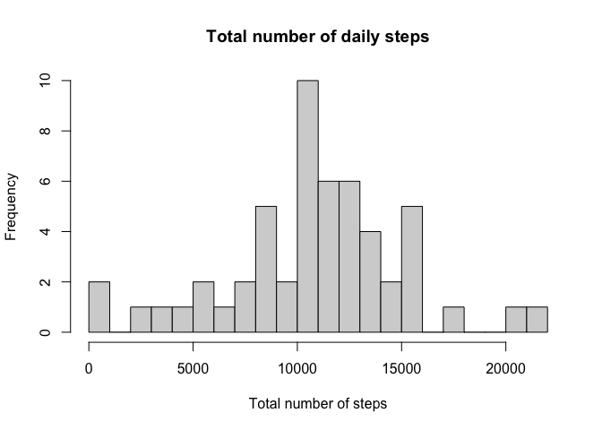
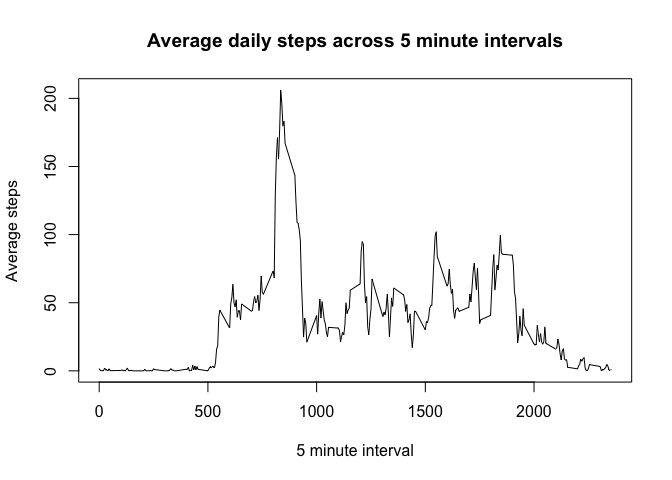
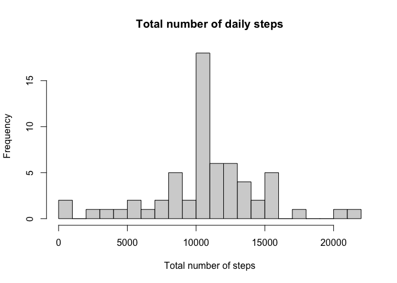
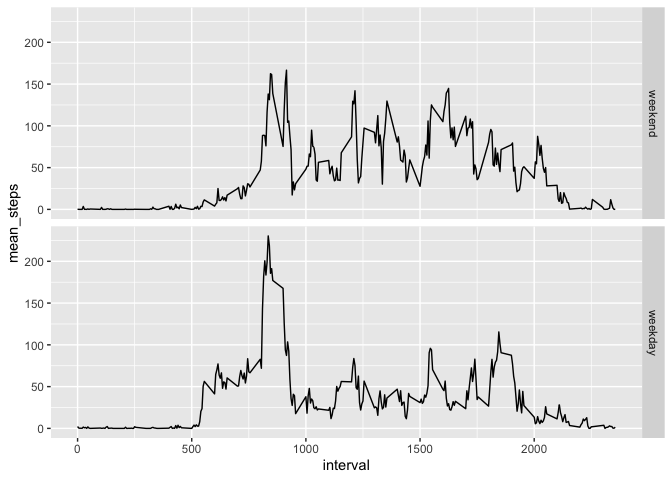

## Loading and preprocessing the data


```r
data <- read.csv("activity.csv")

#removing NA records
data_no_missing <- na.omit(data)
```

## What is mean total number of steps taken per day?


```r
daily_step_counts <- setNames(aggregate(data_no_missing$steps, list(data_no_missing$date), FUN=sum), c("date", "total_steps"))

hist(daily_step_counts$total_steps, xlab="Total number of steps",breaks=20, main="Total number of daily steps")
```

<!-- -->

```r
mean_daily_steps <- mean(daily_step_counts$total_steps)
median_daily_steps <- median(daily_step_counts$total_steps)

sprintf("The mean total number of steps is: %f",mean_daily_steps)
```

```
## [1] "The mean total number of steps is: 10766.188679"
```

```r
sprintf("The median total number of steps is: %i",median_daily_steps)
```

```
## [1] "The median total number of steps is: 10765"
```


## What is the average daily activity pattern?


```r
average_interval_steps <- setNames(aggregate(data_no_missing$steps, list(data_no_missing$interval), FUN=,mean), c("interval", "mean_steps"))

plot(x=average_interval_steps$interval, y=average_interval_steps$mean_steps, type="l", xlab="5 minute interval", ylab="Average steps", main="Average daily steps across 5 minute intervals")
```

<!-- -->

```r
#Sorting by mean steps decreasing to find the max mean steps
sortedData <- average_interval_steps[order(average_interval_steps$mean_steps, decreasing=TRUE),]

#Selecting top interval as highest average
highest_average <- sortedData[1,1]

sprintf("The highest average interval was: %i",highest_average)
```

```
## [1] "The highest average interval was: 835"
```


## Imputing missing values


```r
library(dplyr)
```

```
## 
## Attaching package: 'dplyr'
```

```
## The following objects are masked from 'package:stats':
## 
##     filter, lag
```

```
## The following objects are masked from 'package:base':
## 
##     intersect, setdiff, setequal, union
```

```r
count_of_missing  <- sum(is.na(data$steps))

sprintf("The number of missing steps is: %i",count_of_missing)
```

```
## [1] "The number of missing steps is: 2304"
```

```r
data1 <- data %>% group_by("interval") %>% mutate(abc = ifelse(is.na(data$steps), mean(data$steps, na.rm = T), "data$steps"))

#Imputiong NA steps with the on the average of the intervals (previously calculated)
data_imputed <- data
data_imputed$steps <- ifelse(is.na(data$steps), average_interval_steps$mean_steps, data$steps)

daily_step_counts_imputed <- setNames(aggregate(data_imputed$steps, list(data_imputed$date), FUN=sum), c("date", "total_steps"))

hist(daily_step_counts_imputed$total_steps, xlab="Total number of steps",breaks=20, main="Total number of daily steps")
```

<!-- -->

```r
mean_daily_steps_imputed <- mean(daily_step_counts_imputed$total_steps)
median_daily_steps_imputed <- median(daily_step_counts_imputed$total_steps)

sprintf("The mean total number of steps is: %f for non-imputed and %f imputed ",mean_daily_steps, mean_daily_steps_imputed)
```

```
## [1] "The mean total number of steps is: 10766.188679 for non-imputed and 10766.188679 imputed "
```

```r
sprintf("The median total number of steps is: %f for non-imputed and %f imputed",median_daily_steps, median_daily_steps_imputed)
```

```
## [1] "The median total number of steps is: 10765.000000 for non-imputed and 10766.188679 imputed"
```

```r
print("The mean remained the same and the median was slightly increased. Therefore there is minor impact in the imputation")
```

```
## [1] "The mean remained the same and the median was slightly increased. Therefore there is minor impact in the imputation"
```


## Are there differences in activity patterns between weekdays and weekends?


```r
data_imputed$date <- as.Date(data_imputed$date)
weekdays <- c('Monday', 'Tuesday', 'Wednesday', 'Thursday', 'Friday')

#Adding day column with either weekend or weekday
data_imputed$day <- factor((weekdays(data_imputed$date) %in% weekdays), 
         levels=c(FALSE, TRUE), labels=c('weekend', 'weekday')) 

average_interval_steps_day <- setNames(aggregate(data_imputed$steps, list(data_imputed$day, data_imputed$interval), FUN=,mean), c("day", "interval", "mean_steps"))


library(ggplot2)
ggplot(data=average_interval_steps_day, aes(x=interval, y=mean_steps)) +
  geom_line()+
  facet_grid(day ~ .)
```

<!-- -->
